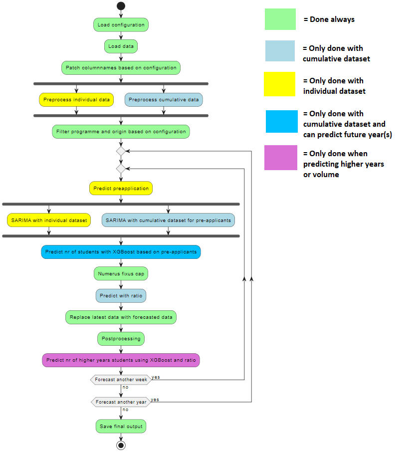
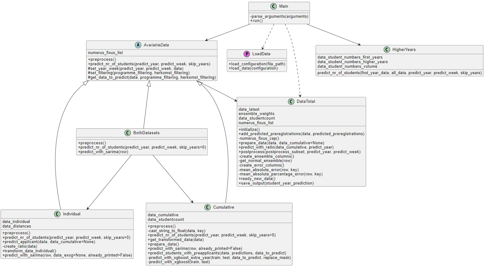
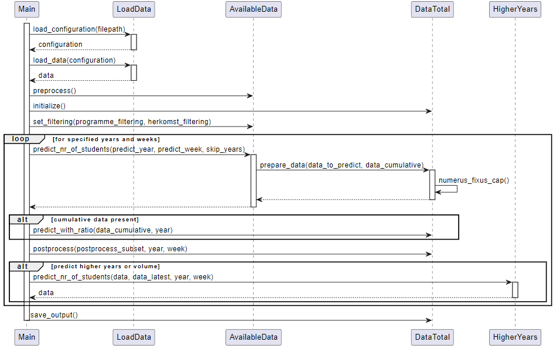

# Quick Start  
After completing the **Prerequisites (short)**, you can start running the script right away. If you need more details, check out the **Prerequisites (longer)**.  

📌 Important: This script only works with the cumulative file and the model designed for it. The individual data file is internal (OSIRIS data) and will be explained later.  

🛠️ **Ongoing Development:** This README is still being improved and will be updated as more people use it, ensuring it works optimally for everyone.  

#### 🔹 Quick script execution:
```
uv run main.py -y 2024 -w 4
```
This runs a prediction for the academic year 2024/2025 in week 4.

⚠️ Note:
- Check the pseudonymized data to see which years and weeks are available. If no year and week are specified, the script defaults to the current week, which may not work with the provided data. 
- Ensure that configuration.json contains the correct file paths for the provided files; otherwise, the script will fail.
- You can use the **base.json** file to filter by program, exam type, or origin to quickly test whether the script works.  
---

# Prerequisites (short)
1. Install uv on your system:

Please refer to the official installation guide of [uv](https://docs.astral.sh/uv/getting-started/installation/)

2. Clone the repository:

```
git clone https://github.com/cedanl/studentprognose.git

cd studentprognose
```

## Usage of program

Execute the script with the current year and week using the following command:

```
uv run main.py -y 2024 -w 4
```

# Why an enrollment forecast?  

Every year, it's an exciting moment: How many students showed up at your classroom door in the first week of September? And what does the October 1st count look like for your entire institution? Well, exciting... we can actually predict this! The goal of the enrollment forecast is to predict, at an early stage, how many students will enroll in each program in the coming year.  

See a concrete example from the Artificial Intelligence program at Radboud University:  

<div align="center">
  

*The green line represents the final number of enrollments in this program. The different models (purple and yellow lines) have been stable since March (week 14), with the yellow line even stable from the beginning.*  
</div>  

This gives an educational institution reliable insights into the final number of students months in advance. As a result, institutions can efficiently allocate schedules, staff, and scarce financial resources. Also, check out an [interview](https://www.voxweb.nl/nieuws/de-universiteit-heeft-nu-haar-eigen-glazen-bol-nieuw-model-voorspelt-toekomstige-instroom-van-studenten) with Amir about the model.  


---
# Contributing to further development  

On October 29, 2024, Amir Khodaie and Timo Koster shared the [evaluations of their enrollment forecasts](https://community-data-ai.npuls.nl/groups/view/44d20066-53a8-48c2-b4e9-be348e05d273/project-center-for-educational-data-analytics-ceda/events/view/610c71bd-5859-4092-906c-58bbfdf9801c/instroomprognose-terugblik-en-vooruit-kijken). The session was recorded—if you would like to watch it back, please contact Corneel den Hartogh (corneel.denhartogh@surf.nl).  

Want to contribute ideas? Feel free to join the [working group](https://edu.nl/6d69d).  

Thanks to your previous feedback, we have improved the code and added documentation. We have also included a test file with pseudonymized data so you can test the functionality. Note: This is only for the cumulative model (see below).  

The next step was to create a script that transforms raw Studielink count files into the cumulative data format used by the model. This has now been completed, and the script is called **"rowbind_inputfiles.py"**.  

It is difficult to determine which institutions do or do not have a suitable file. We have assumed that institutions have one large Studielink count file that still needs to be transformed into the cumulative data file required by the model. This script performs that transformation.  

⚠️ **Important:** Make sure to adjust the file path correctly so you can run the script properly. The script is located in the **standalone** folder.  

Additionally, we are working on a better description of the 'individual' file.  

To be continued!  

# Student forecasting model

This Python script predicts the influx of students at the Radboud University for the current year and week. The year and week can also be specified.

---
# Prerequisites (longer)

1. Install uv on your system:

Please refer to the official installation guide of [uv](https://docs.astral.sh/uv/getting-started/installation/)

2. Clone the repository:

```
git clone https://github.com/cedanl/studentprognose.git

cd studentprognose
```

---
# Usage of program
Execute the script with the current year and week using the following command:

```
uv run main.py
```

To predict different years/weeks or in a different way, use any of the following command line parameters to your liking.

### Years and weeks specification

Execute the script with a specified year and week with `-y` and `-w`, e.g.:

```
uv run main.py -w 6 -y 2024
uv run main.py -W 1 2 3 -Y 2024
uv run main.py -year 2023 2024
uv run main.py -week 40 41
```

For predicting multiple years/weeks we also provide slicing, in the example the weeks 10 up to and including 20 will be predicted:

```
uv run main.py -w 10 : 20 -y 2023
```

### Datasets (use only if you have multiple datasets, other than the Studielink data)

The main datasets that are used in this script are the cumulative data per programme/origin/year/week and individual data per student. If one of these is not present then only the other dataset can be used.

```
uv run main.py -d individual
uv run main.py -D cumulative
uv run main.py -dataset both
```

### Configuration

The script has to have a configuration file for numerous different reason. The path to the configuration is `configuration/configuration.json` by default, but can be changed in the terminal:

```
python main.py -c path/to/configuration.json
python main.py -configuration longer/path/to/config.json
```

### Filtering

The script has to have a filtering file to define the programme and herkomst filtering. The path to the filtering is `configuration/filtering/base.json` by default, but can be changed in the terminal:

```
python main.py -f path/to/filtering.json
python main.py -filtering longer/path/to/filtering.json
```

### Predict a year ahead

Still in development!

### Syntax

⚠️ **Note:** This is outdated and needs adjustment. Updates coming soon!!  

In the following the syntax for all command line options is shown:

| Cmd setting             | Short notation | Large notation | Cmd option             | Short notation | Large notation |
|-------------------------|----------------|----------------|------------------------|----------------|----------------|
| Prediction years        | -y or -Y       | -year          | One or more years      | 1 2 3          | 1 : 3          |
| Prediction weeks        | -w or -W       | -week          | One or more weeks      | 10 11 12       | 10 : 12        |
| Dataset                 | -d or -D       | -dataset       | Only individual        | i              | individual     |
| Dataset                 | -d or -D       | -dataset       | Only cumulative        | c              | cumulative     |
| Dataset                 | -d or -D       | -dataset       | Both dataset           | b              | both           |
| Configuration           | -c or -C       | -configuration | Config file path (str) |                |                |
| Student year prediction | -sy or -SY     | -studentyear   | First years            | f              | first-years    |
| Student year prediction | -sy or -SY     | -studentyear   | Higher years           | h              | higher-years   |
| Student year prediction | -sy or -SY     | -studentyear   | Volume                 | v              | volume         |
| Skip years              | -sk or -SK     | -skipyears     | Skip years             | 1              | 1              |

### Large example

Example 1: Predict volume of the years 2023 and 2024, weeks 10 up to and including 20 and use both datasets

```
uv run main.py -y 2023 2024 -w 10 : 20 -d b -sy v
```

Example 2: Predict first years students of the academic year 2025/2026, week 5, use cumulative, only postprocess new predicted data

```
uv run main.py -y 2025 -w 5 -d b -sy f -sk 1
```

### Testing

There are currently 6 tests defined. A different test for both datasets, the cumulative dataset and the individual. For every dataset there is a fast and exhaustive test. The tests will automatically make sure that the right configuration is loaded. The tests can be ran by using the Makefile commands for simplicity.

Example: Running the exhaustive test for both datasets

```
make test-eb
```

Please look at the Makefile for the other commands.

## Pre-commit

Pre-commit hooks are essential tools for maintaining code quality and consistency. They run automatically before each commit, catching common issues early in the development process. By enforcing coding standards and style guides, pre-commit hooks ensure that the codebase is clean and consistent, making it easier to read, maintain, and collaborate on.

In this project, we use several pre-commit hooks to enhance code quality. The check-yaml hook checks for syntax errors in YAML files, preventing potential misconfigurations. The end-of-file-fixer ensures that files end with a newline character, meeting POSIX standards and avoiding file concatenation issues. The trailing-whitespace hook removes unnecessary whitespace, leading to cleaner commits. Finally, black automatically formats Python code, ensuring consistent style and readability.

These hooks are run automatically before every commit. When an error is detected, it will be 'repaired' automatically. Note that you have to stage and commit these changes again. Otherwise no commit was done.

Note: Committing via the terminal will reveal more information about the concerning pre-commit than committing via Github Desktop/VSCode Source Control.

## Pre-push

In the pre-push process, a unit test is executed to verify the final results of the program. This step ensures that all changes meet the expected outcomes before being pushed to the remote repository. By running these tests, we can catch potential errors or regressions early, maintaining the integrity and reliability of the codebase. This automated check provides an additional layer of assurance that new changes will not introduce unexpected issues, facilitating a smoother integration of new code.

Because this process takes some time (appr. 165 seconds), it is sometimes useful to bypass this process. To do this, you can add the `--no-verify` flag when pushing.

```
$ git push --no-verify
```

NOTE: Please only do this when necessary. NEVER do this when pushing to the main branch.

## Process of script

The following image depicts the process of the script when executed with available datasets.



## Class diagram & sequence diagram

The following images represent the class diagram and sequence diagram (of the main script).





## Description of input and output files

### Input

#### individual

Every line in this dataset represents an individual (pre-)application. The data consists of a key, information about the (pre-)application and information about the (pre-)applicant. This data is used to predict the 'SARIMA_individual'. This is data obtained by an internal team.

#### cumulative

Every line in this dataset represents the number of applications per programme, per 'Herkomst', per year and week and per 'Herinschrijving'/'Hogerejaars' value. This data is used to predict the 'SARIMA_cumulative'. This is data obtained by an internal team. This data is obtained via studielink.

#### latest

For every programme, herkomst, year and week a line is written containing data about the applications, all the different predictions and error (MAE and MAPE) values. This data is mostly used for calculating volume and higher years predictions. This data is obtained via studielink.

#### student_count_first-years

This data consists of the actual number of first year students per year for every programme per herkomst. This data includes first year bachelor, master and pre-master students. This data is used to obtain the training data with the student count per programme when calculating the SARIMA_cumulative. Besides that it is also used for ratio prediction. This data is obtained via studielink.

#### student_count_higher-years

This data consists of the actual number of higher year students per year for every programme per herkomst. This data includes first year bachelor and master students. This data is used to calculate the number of higher year/volume students by ratio. This data is obtained via studielink.

#### student_volume

This data consists of the actual number of first- and higher year students per year for every programme per herkomst. This data includes first year bachelor and master students. This data is used to calculate the number of higher year/volume students by ratio. This data is obtained via studielink.

#### distances

This data consists of distances from residences in the Netherlands to the university. This data will be merged into individual data of NL students to add this to the data that is used for XGBoost for calculating SARIMA_individual. This data is obtained via studielink.

#### weighted_ensemble

This data consists of the weights given for every model used for the ensemble prediction. This data is obtained via studielink.


### Output

#### output_prelim.xlsx

Preliminary output consisting of all the predictions that are made in this execution of the script. This data will afterwards be added to one of the three complete output files defined below.

#### output_first-years.xlsx

The complete output file consisting the predictions about first year students.

#### output_higher-years.xlsx

The complete output file consisting the predictions about higher year students.

#### output_volume.xlsx

The complete output file consisting the volume predictions.
